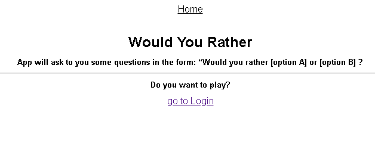
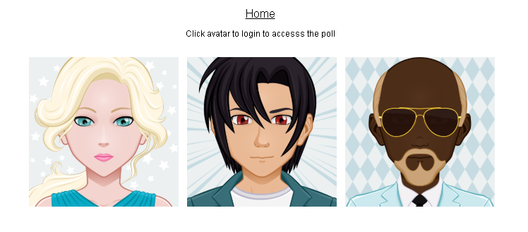
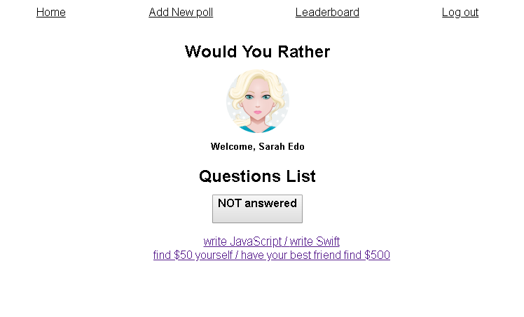

## What is "Would you rather?"



"Would You Rather?" Project it's a web app that lets a user play the “Would You Rather?” game. The game goes like this: A user is asked a question in the form: “Would you rather [option A] or [option B] ?”. Answering "neither" or "both" is against the rules.

In Would You Rather?, users are be able to answer questions, see which questions they haven’t answered, see how other people have voted, post questions, and see the ranking of users on the leaderboard.


## Rubricks

### Application Setup

**Is the application easy to install and start?** 

This project was bootstrapped with [Create React App](https://github.com/facebookincubator/create-react-app). Facebook has created it to generate a boilerplate version of a React application.

Besides providing something that works out-of-the-box, this has the added benefit of providing a consistent structure for React apps that you will recognize as you move between React projects. It also provides an out-of-the-box build script and development server.


**The application requires only npm install and npm start to install and launch?** |

Yes. It is. Once you’ve cloned the project, cd in the would-you-rather directory and run npm install then npm start. This assumes you’ve got Node.js already installed. In general, look at the scripts definition in package.json to learn what the [available actions](https://github.com/reactjs/redux/tree/master/examples/todomvc#available-scripts) are for a package. 

**Does the application include README with clear installation and launch instructions?**

This is what your are reading.

### Login Flow

**Does the application have a way to log in and log out?**

When app start it goes to "login"



You have to select one user. When you click inside avatar's user you are authenticated and app goes to home page. 

 

Where you can click on log out tag navigation, and comes back to first screen "login".
If you types something in the address bar, log in page is shown.

**Does the application work correctly regardless of which person the user impersonates?**

Checked. It works.

### Application Functionality

**Does the home page have the desired functionality?**

The answered and unanswered polls are both available at the root, with a button than toggle between them. The unanswered questions are shown by default.The name of the logged in user is visible on the page.The user can navigate to the leaderboard.The user can navigate to the form that allows the user to create a new poll

**Are the polling questions listed in the correct category (Unanswered vs Answered), and do they have the desired functionality on the home page?**

Each polling question resides in the correct category, each one link to their details and the polls in both categories are arranged from the most recently created (top) to the least recently created (bottom).

**Are the details of each poll displayed with all of the relevant information?**

The details of the poll are available at `questions/:question_id`.

When a poll is clicked on the home page, the following is shown:

1.the text “Would You Rather”;
2.the picture of the user who posted the polling question.
3.the two options.

For answered polls, each of the two options contains the following:

1.the text of the option;
2.the number of people who voted for that option;
3.the percentage of people who voted for that option.

The option selected by the logged in user should be clearly marked.

When the user is logged in, the details of the poll are shown. If the user is logged out, he/she is asked to log in before being able to access the poll.

The application asks the user to sign in and shows a 404 page if that poll does not exist. New polls will not be accessible at their url because of the way the backend is set up in this application.

**Does the voting mechanism work correctly?**

1.Upon voting in a poll, all of the information of the answered poll is displayed.
2.The user’s response is recorded and is clearly visible on the poll details page.
3.When the user comes back to the home page, the polling question appears in the “Answered” column.
4.The voting mechanism works correctly, and the data on the leaderboard changes appropriately.


**Can users add new polls?**

Yes. 
1.The form is available at `/add`.
2.The application shows the text “Would You Rather” and has a form for creating two options.
3.Upon submitting the form, a new poll is created and the user is taken to the home page.
4.The new polling question appears in the correct category on the home page.The form is available at `/add`. 

**Does the leaderboard work correctly and have the desired functionality?**

1.The Leaderboard is available at/leaderboard.
2.Each entry on the leaderboard contains the following:
the user’s name;
the user’s picture;
the number of questions the user asked; and
the number of questions the user answered.

3.Users are ordered in descending order based on the sum of the number of questions they’ve answered and the number of questions they’ve asked.

**Is the application navigable?**

The app contains a navigation bar that is visible on all of the pages.

The user can navigate between the page for creating new polls, and the leaderboard page, and the home page without typing the address into the address bar.

**Does the application interact with the backend correctly?**

1.The data that’s initially displayed is populated correctly from the backend.
2.Each user’s answer and each new poll is correctly recorded on the backend.

### Architecture

**Does the store serve as the application’s single source of truth?**

1.The store is the application’s source of truth.
2.Components read the necessary state from the store; they do not have their own versions of the same state.
3.There are no direct API calls in the components' lifecycle methods.


**Is application state managed by Redux?**

1.Most application state is managed by the Redux store. State-based props are mapped from the store rather than stored as component state.
2.Form inputs and controlled components may have some state handled by the component.

**Does application state update correctly?**

1.Updates are triggered by dispatching action creators to reducers.
2.Reducers and actions are written properly and correctly return updated state to the store.

**Does the architecture of the application make sense?**


## Folder Structure

After creation, your project should look like this:

```
would-you-rather/
  README.md (this document)
  package.json
  images/ (images for this document. Readme
  node_modules/   
  public/ (icons, avatars, images for the app)
    favicon.ico
    jondoe.png
    sarhaedo.png
    tylermcginnis.png
    index.html
  src/
    actions/ (actions to dispatch to redux store)
      authedUsers.js (actions for user's authentication )
      questions.js  (actions about receiving questions)
      shared.js (loading and saving actions for both users/questions  )
      users.js (receving users)

    components/
      App.js (squeleton app component)
      Home.js (initial page)
      LeaderBoard.js (page for viewing leaderBoadr )
      Login.js (login page)
      Logout.js (logout page)
      Nav.js (main nav)
      NewPoll.js (add a poll to app)
      NoMatch.js (404 page)
      Poll.js (viewing result for questions answered)
      QuestionsList.js (list of questions to answer and answered)
      Root.js (adds Router)
      UserHome.js (home when user is authenticated)

    middleware/
      index.js
      logger.js

    reducers/
      autheduser.js
      index.js
      questions.js
      users.js

    utils/
      DATA.js (Data as a fake database)
      api.js (getInitialData function)

    index.css
    index.js (is the JavaScript entry point. It takes Redux Store and passing to Root component)

```

For the project to build, **these files must exist with exact filenames**:

* `public/index.html` is the page template;
* `src/index.js` is the JavaScript entry point.


## Getting Started with Would-you-rather

In the project directory, install Woylt-you-rather:

`npm install` 

Alternatively you may use yarn:

`yarn install` 

then run

`npm start` 

or

`yarn start`


Runs the app in the development mode.<br>
Open [http://localhost:3000](http://localhost:3000) to view it in the browser.

The page will reload if you make edits.<br>
You will also see any lint errors in the console.

## Supported Browsers

By default, the generated project uses the latest version of React.

You can refer [to the React documentation](https://reactjs.org/docs/react-dom.html#browser-support) for more information about supported browsers.

